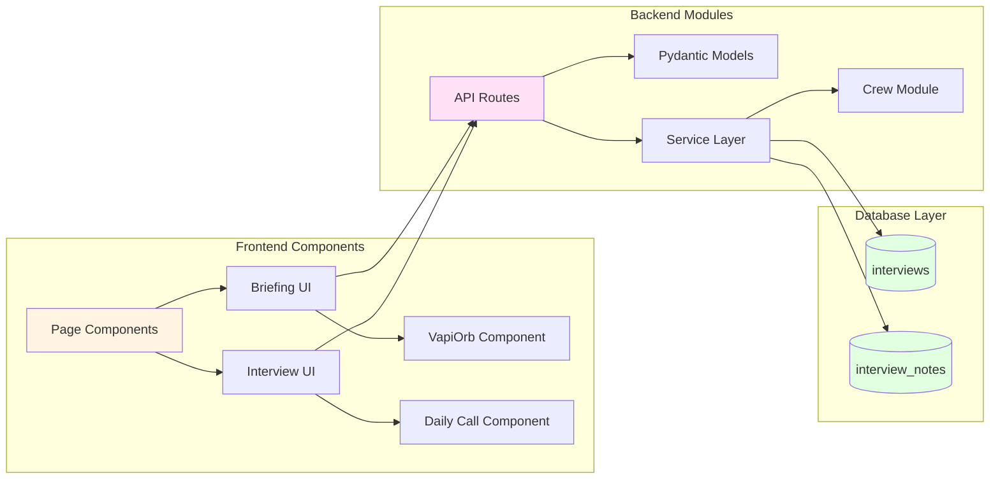

# Component Diagram

## Frontend Components

- **Page Components**: SvelteKit page components with role-based routing
- **Briefing UI**: Interface for viewing and interacting with candidate briefings
- **Interview UI**: Interface for conducting video interviews
- **VapiOrb Component**: Voice AI interaction component
- **Daily Call Component**: Video call interface component

## Backend Modules

- **API Routes**: FastAPI route handlers organized by feature
- **Crew Module**: CrewAI agent definitions and orchestration
- **Pydantic Models**: Data validation and serialization models
- **Service Layer**: Business logic separated from route handlers

## Database Tables

- **interviews**: Stores interview metadata and context
- **interview_notes**: Stores notes from interviews (from CrewAI or Host)
