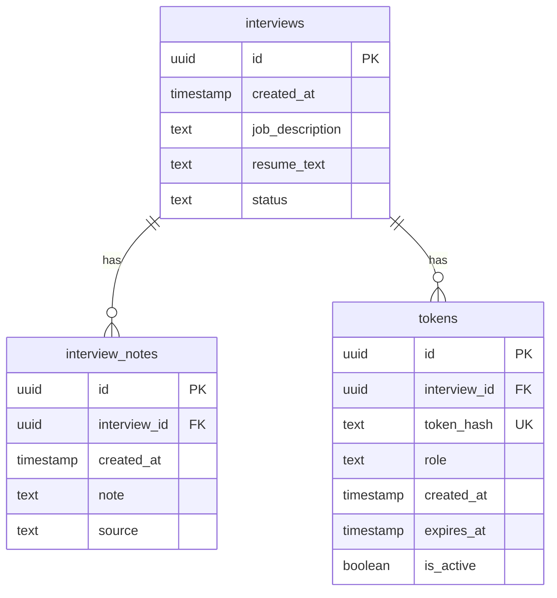

# Entity-Relationship Diagram (ERD)

## Table Descriptions

### interviews

Stores metadata about each interview session.

- **id** (uuid, primary key): Unique identifier for the interview
- **created_at** (timestamp with time zone): When the interview was created
- **job_description** (text): The job description for the position
- **resume_text** (text): The candidate's resume text
- **status** (text): Current status of the interview (e.g., "pending", "in_progress", "completed")

### interview_notes

Stores notes captured during or after the interview.

- **id** (uuid, primary key): Unique identifier for the note
- **interview_id** (uuid, foreign key): References the parent interview
- **created_at** (timestamp with time zone): When the note was created
- **note** (text): The content of the note
- **source** (text): Origin of the note (e.g., "CrewAI", "Host", "System")

### tokens

Stores authentication tokens for accessing interviews.

- **id** (uuid, primary key): Unique identifier for the token record
- **interview_id** (uuid, foreign key): References the parent interview
- **token_hash** (text, unique): Hashed version of the token (for security, never store plain tokens)
- **role** (text): Role associated with the token ("host" or "candidate")
- **created_at** (timestamp with time zone): When the token was created
- **expires_at** (timestamp with time zone): When the token expires (nullable, can be indefinite)
- **is_active** (boolean): Whether the token is currently active (can be revoked)

## Relationships

- **One-to-Many**: One interview can have many interview notes
- **One-to-Many**: One interview can have multiple tokens (typically one host token and one candidate token)
- **Foreign Key Constraints**:
  - `interview_notes.interview_id` references `interviews.id`
  - `tokens.interview_id` references `interviews.id`
