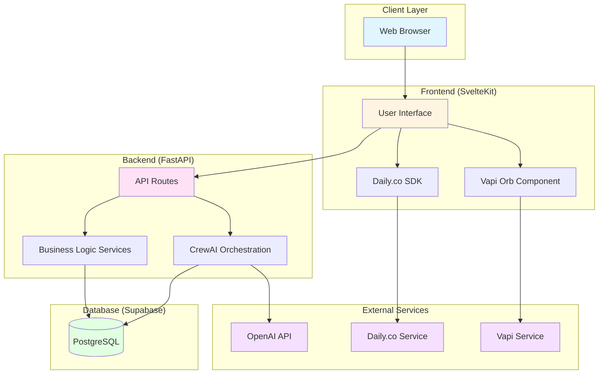

# System Architecture Diagram

## Component Descriptions

- **Web Browser**: User's browser accessing the application
- **User Interface**: SvelteKit frontend with Tailwind CSS
- **Vapi Orb Component**: Voice AI interface component
- **Daily.co SDK**: Video conferencing integration
- **API Routes**: FastAPI REST endpoints
- **CrewAI Orchestration**: AI agent coordination for briefing generation
- **Business Logic Services**: Core application logic
- **PostgreSQL**: Supabase database for persistent storage
- **OpenAI API**: LLM provider for CrewAI agents
- **Daily.co Service**: Video conferencing infrastructure
- **Vapi Service**: Voice AI service
